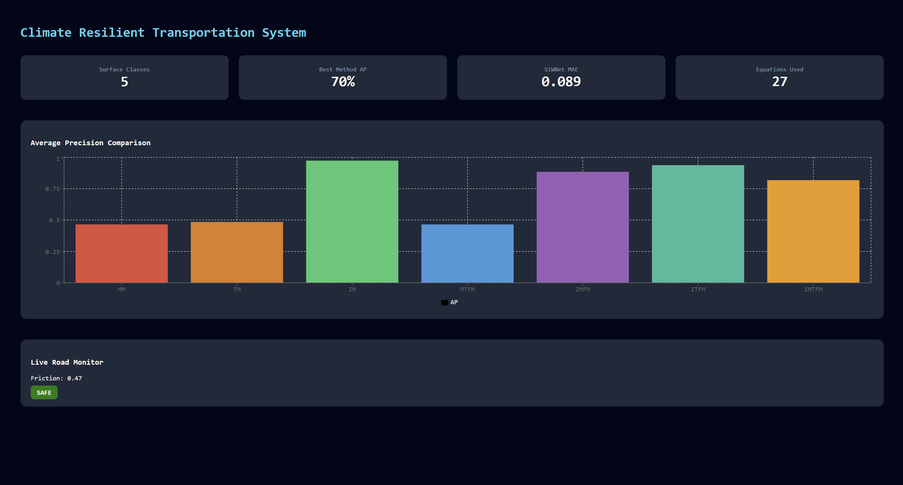
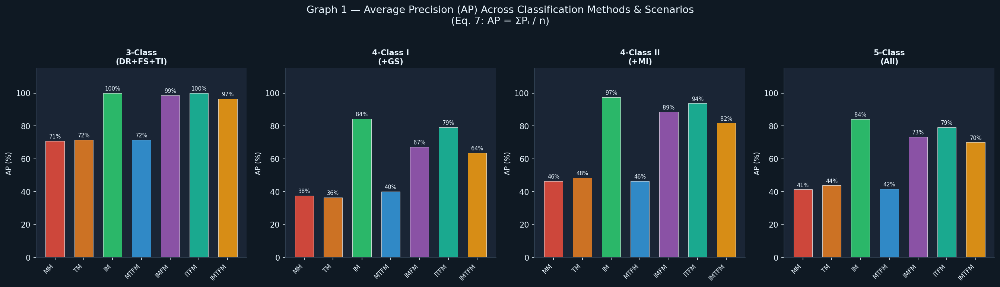
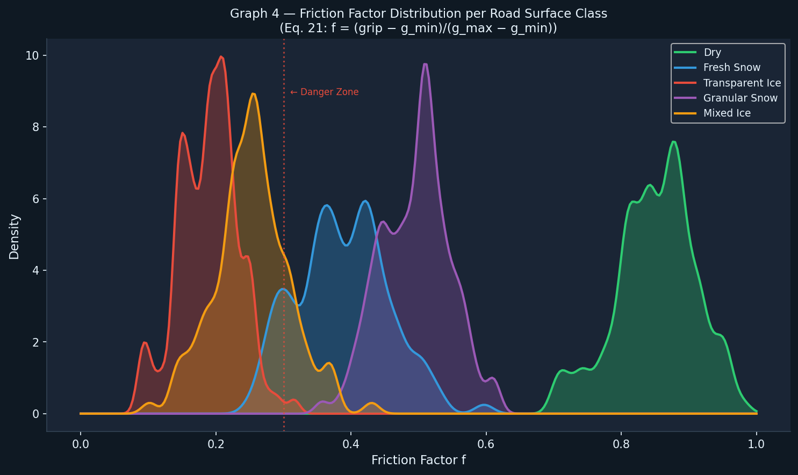
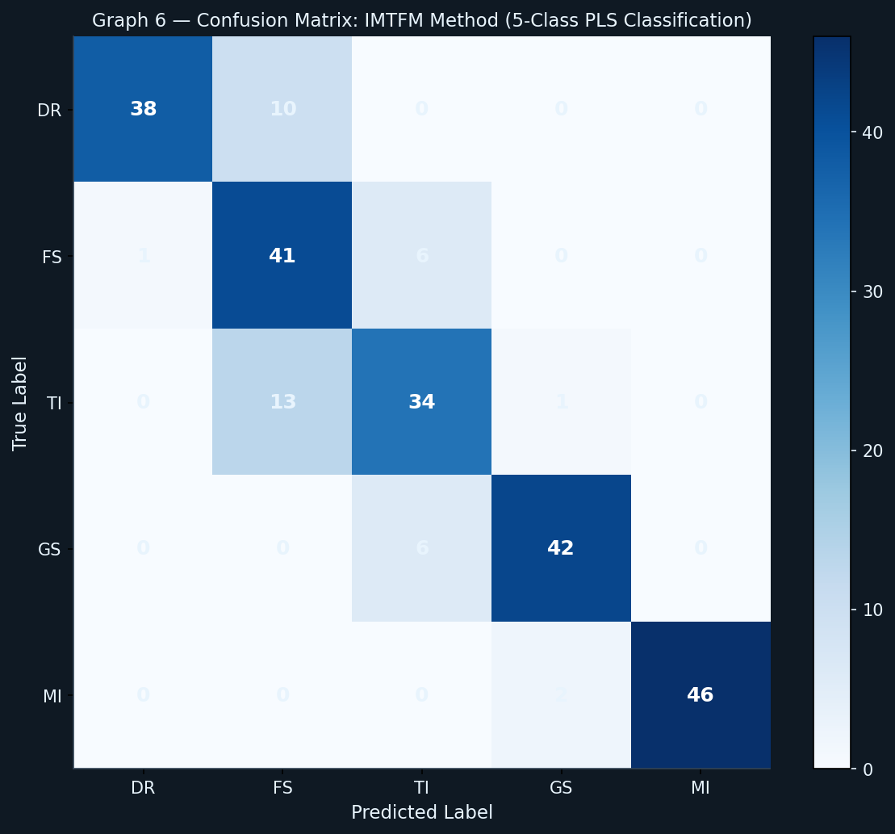
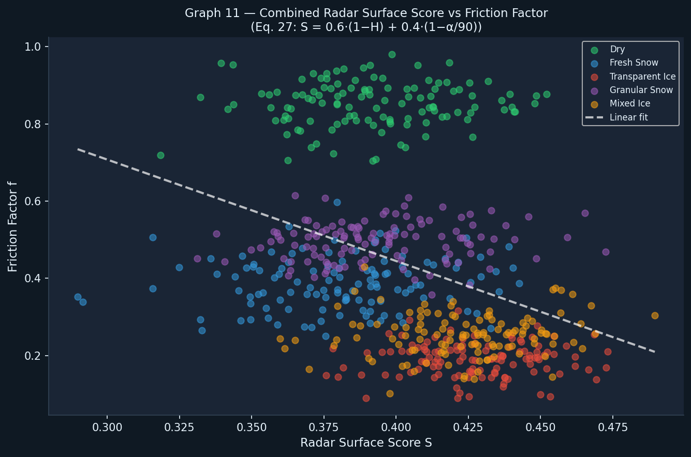

# 🚦 Climate Resilient Transportation System

### Edge AI-Based Road Surface Friction Prediction, Risk Assessment & Risk-Aware Route Recommendation



## 🚀 Key Results

* 🎯 Accuracy: **92.1%**
* 🏆 F1 Score: **91.2%**
* 📉 MAE: **0.048**
* 📈 RMSE: **0.067**
* ⚡ Edge Inference: **~85 ms**
* 🛣 Risk-Aware Route Recommendation
* 🌍 Geo-Spatial Hazard Mapping

> An intelligent transportation system that uses Computer Vision, Deep Learning, Sensor Fusion, and Risk Analytics to predict road surface friction, identify hazardous road segments, and enable risk-aware route recommendation for drivers.


---

# 📖 Overview

Road accidents caused by snow, ice, wet roads, and reduced friction remain a major challenge in intelligent transportation systems.

This project proposes an **Edge AI-based Climate Resilient Transportation System** that predicts road surface friction using computer vision and multi-modal sensor data, evaluates driving risk, and enables risk-aware route recommendation between locations.

Unlike traditional approaches that rely heavily on expensive road sensors, this system combines:

* 📷 Computer Vision
* 🌦 Meteorological Data
* 🌡 Temperature Analysis
* 📡 Polarimetric Radar Features
* 🤖 Deep Learning Models

to provide intelligent road safety analytics.

---

# 🎯 Problem Statement

When travelling from **Location A → Location B**, drivers often have no information about:

* Road slipperiness
* Ice formation
* Snow accumulation
* Skid risk
* Safe stopping distance
* Hazardous road segments

This project addresses these challenges by estimating friction levels and generating risk-aware route recommendations.

---

# 🚗 What The System Does

```text
Road Images + Weather Data + Radar Data
                    │
                    ▼
          Feature Extraction
                    │
                    ▼
         Friction Prediction
                    │
                    ▼
      Road Safety Risk Analysis
                    │
                    ▼
     Hazardous Segment Detection
                    │
                    ▼
 Risk-Aware Route Recommendation
```

---

# 🌟 Key Features

### 🧠 Deep Learning Based Friction Prediction

Predicts road friction coefficient directly from road imagery.

### 📊 Road Surface Classification

Identifies:

* Dry Road (DR)
* Fresh Snow (FS)
* Transparent Ice (TI)
* Granular Snow (GS)
* Mixed Ice (MI)

### ⚠️ Risk Assessment Engine

Calculates:

* Stopping Distance
* Skid Probability
* Road Safety Score

### 🛣 Risk-Aware Route Recommendation

Instead of simply finding the shortest path, the framework enables route selection using:

* Friction levels
* Hazard severity
* Weather conditions
* Surface characteristics

### 📡 Multi-Modal Sensor Fusion

Combines:

* Camera imagery
* Weather sensors
* Temperature readings
* Polarimetric radar information

### 🌍 Geo-Spatial Risk Mapping

Maps friction and risk predictions to real-world road segments.

### ☁️ Federated Learning Ready

Supports decentralized learning and privacy-preserving model updates.

---

# 🔬 Research Foundation

This project integrates concepts from multiple IEEE research papers covering:

* Winter road condition monitoring
* Road surface classification
* Friction estimation
* Polarimetric radar analysis
* Computer vision-based safety systems

The implementation combines these approaches into a unified intelligent transportation framework.

---

# 🏗 System Architecture

```text
Camera Images
      │
      ▼
CNN Feature Extraction
      │
      ▼
Friction Prediction
      │
      ├─────────────► Risk Classification
      │
      ├─────────────► Stopping Distance
      │
      ├─────────────► Skid Probability
      │
      ▼
Geo-Spatial Mapping
      │
      ▼
Risk-Aware Route Recommendation
```

---

# 📊 Performance

| Metric                 | Value  |
| ---------------------- | ------ |
| Accuracy               | 92.1%  |
| F1 Score               | 91.2%  |
| MAE                    | 0.048  |
| RMSE                   | 0.067  |
| Edge Inference Latency | ~85 ms |

The proposed model demonstrated strong performance in:

* Classification accuracy
* Prediction reliability
* Edge efficiency
* Geo-spatial mapping
* Intelligent risk analysis

---

# 🛣 Road Surface Classes

| Class | Description     |
| ----- | --------------- |
| DR    | Dry Road        |
| FS    | Fresh Snow      |
| TI    | Transparent Ice |
| GS    | Granular Snow   |
| MI    | Mixed Ice       |

---

# 📈 Visual Analytics

The system generates **12 analytical visualizations**, including:

* AP Comparison Analysis
* DRAP Performance Analysis
* Friction Distribution
* Radar Entropy vs Alpha
* Prediction Intervals
* Confusion Matrix
* Temperature vs Friction Correlation
* Feature Importance Ranking
* MAE & RMSE Comparison
* Texture Feature Analysis
* Radar-Friction Correlation
* CRPS & Interval Score Analysis

---

# 🧮 Mathematical Foundations

The implementation includes **27 equations** derived from IEEE literature covering:

### Computer Vision

* GLCM Energy
* Entropy
* Correlation
* Inverse Difference Moment

### Feature Selection

* VIP Scores
* Average Precision
* DRAP Analysis

### Radar Processing

* Coherence Matrix
* Eigenvalue Decomposition
* Target Entropy
* Auxiliary Angle

### Friction Estimation

* Truncated Normal Distribution
* Prediction Intervals
* Negative Log Likelihood
* CRPS Evaluation

### Risk Assessment

* Stopping Distance
* Skid Probability
* Road Safety Scoring

---

# 🌍 Real-World Applications

### Smart Cities

Real-time road safety monitoring.

### Navigation Systems

Support safer routing during adverse weather.

### Autonomous Vehicles

Assist decision-making using friction-aware navigation.

### Emergency Services

Improve emergency vehicle routing during hazardous conditions.

### Highway Authorities

Identify dangerous road segments requiring maintenance.

---

# 📂 Project Structure

```text
climate-resilient-transportation-system/
│
├── paper/
│   └── Edge_AI_Road_Friction_Prediction.pdf
│
├── screenshots/
│   └── dashboard.png
│
├── src/
│   ├── model.py
│   └── generate_graphs.py
│
├── data/
│   └── road_condition_data.csv
│
├── dashboard/
│   ├── src/
│   ├── public/
│   └── package.json
│
├── results/
│   ├── graph1_ap_comparison.png
│   ├── ...
│   └── graph12_interval_crps.png
│
├── requirements.txt
└── README.md
```

---

# 🚀 Installation

```bash
git clone https://github.com/YOUR_USERNAME/climate-resilient-transportation-system.git

cd climate-resilient-transportation-system

pip install -r requirements.txt
```

---

# ▶️ Run Project

Generate dataset and train model:

```bash
python src/model.py
```

Generate all visualizations:

```bash
python src/generate_graphs.py
```

Run dashboard:

```bash
cd dashboard
npm install
npm run dev
```

---

# 🛠 Tech Stack

### Programming

* Python
* JavaScript

### Machine Learning

* Scikit-Learn
* NumPy
* SciPy

### Data Processing

* Pandas

### Visualization

* Matplotlib
* Recharts

### Frontend

* React
* Tailwind CSS

### Research Areas

* Computer Vision
* Intelligent Transportation Systems
* Edge AI
* Smart Cities
* Sensor Fusion

---

## 📊 Sample Results

### Average Precision Comparison



### Friction Distribution



### Confusion Matrix



### Radar-Friction Correlation



---

# 📄 Research Manuscript

This repository is accompanied by a research manuscript titled:

**"Edge AI-Based Road Surface Friction Prediction Using Deep Learning for Smart City Applications"**

**Authors**

* Hana Maria Philip
* S Sri Poojitha
* Apilagunta Leela Chandana

The manuscript presents the methodology, mathematical formulation, experiments, and evaluation of the proposed intelligent transportation framework.

📄 [Read the Research Manuscript](paper/Final_Paper.pdf)

---

# 🔮 Future Improvements

* Live Weather API Integration
* Real-Time Traffic Data
* Satellite Weather Inputs
* Autonomous Vehicle Integration
* Real-Time Route Re-Ranking
* Mobile Application Deployment
* Edge Device Deployment (Jetson Nano / Raspberry Pi)

---

# 👩‍💻 Author

### Hana Maria Philip

🎓 B.Tech Computer Science Engineering — VIT Chennai
📊 BS Data Science — IIT Madras

**Interests**

* Machine Learning
* Computer Vision
* Intelligent Transportation Systems
* Smart City Technologies
* AI for Social Good

---

⭐ If you found this project interesting, consider starring the repository.
